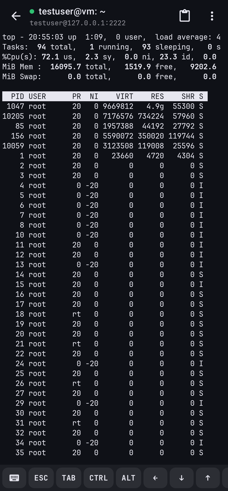
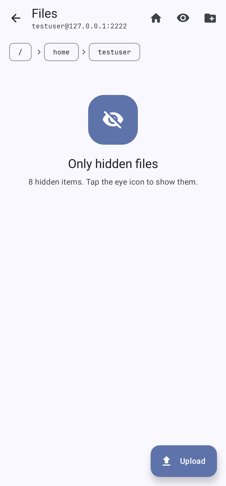
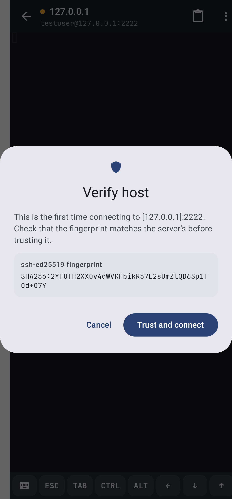
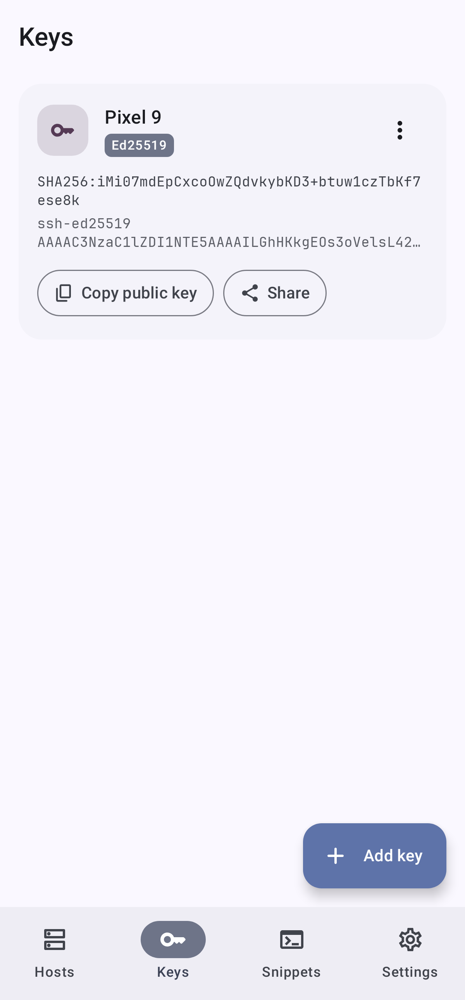
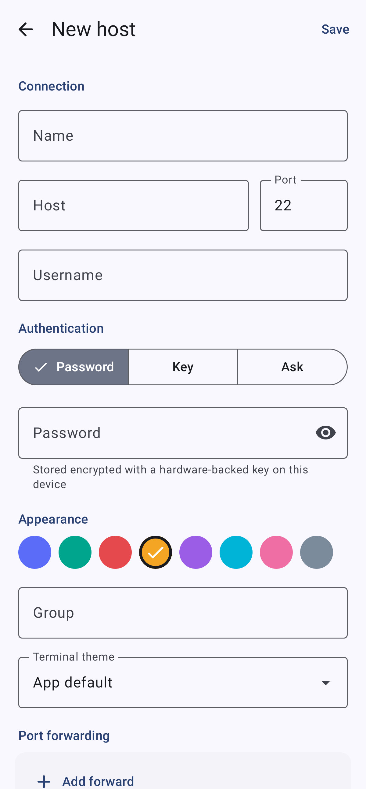
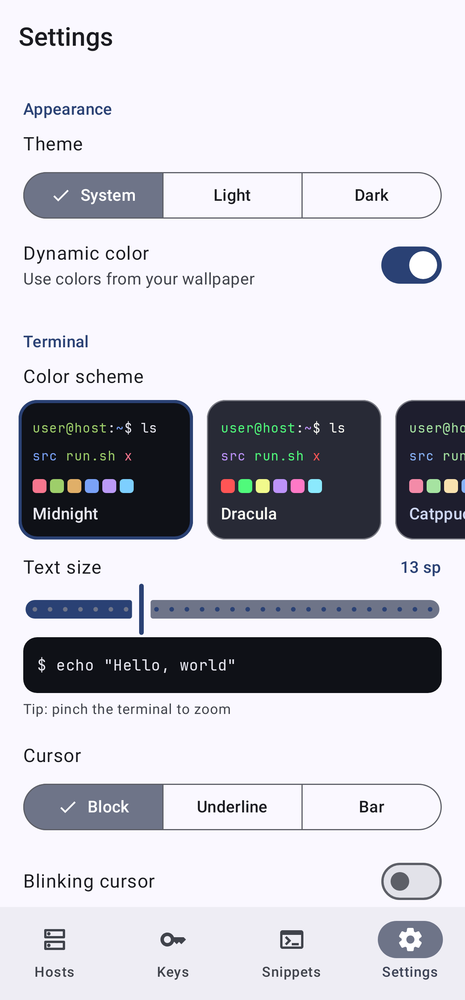

# Terminal

A modern, fast and easy to use SSH client for Android, built with Kotlin and Jetpack Compose.

<p>
  
  
  
  
</p>
<p>
  
  
  
  
</p>

## Features

**Terminal**
- Custom xterm-compatible emulator: 256 colors and truecolor, bold/italic/underline/strikethrough,
  alternate screen, scroll regions, DEC line drawing, mouse reporting (SGR and legacy),
  bracketed paste, OSC window titles, OSC 52 clipboard, cursor shapes
- Correct wide-character (CJK, emoji) and combining-character handling
- Scrollback with reflow when the screen size changes (rotation, keyboard showing)
- Pixel-perfect box drawing and block elements, bundled JetBrains Mono font
- Pinch to zoom, fling to scroll back, long press to select with draggable handles, copy and paste
- Extra keys row (Esc, Tab, sticky Ctrl/Alt, arrows with auto-repeat, Home/End, PgUp/PgDn, F1 to F12, symbols)
- Hardware keyboard support including Ctrl/Alt/Shift combinations; optional volume keys as Ctrl/Alt
- 11 color schemes (Midnight, Dracula, Catppuccin, Nord, Gruvbox, One Dark, Solarized, and more), per host override

**SSH**
- Password, keyboard-interactive (2FA prompts) and public key authentication
- Ed25519, ECDSA and RSA keys: generate on device or import OpenSSH, PEM and PuTTY keys
  (passphrase-protected keys are decrypted once on import)
- Trust-on-first-use host key verification with SHA256 fingerprints and a clear warning when a key changes
- Jump hosts (ProxyJump)
- Local, remote and dynamic (SOCKS4/4a/5) port forwarding
- SFTP file browser: browse, upload, download, rename, delete, create folders
- Multiple concurrent sessions kept alive by a foreground service, with keep-alives and one-tap reconnect
- Startup command per host (e.g. `tmux new -A -s main`), optional compression
- Quick connect with `user@host:port`, and `ssh://` links

**App**
- Material 3 design with dynamic color, light and dark themes
- Saved hosts with groups, colors and search; snippets you can send to any session
- Passwords and private keys encrypted with an AES-256-GCM key held in the Android Keystore
- Optional app lock with biometrics or the device screen lock
- No cloud backup of secrets (they are bound to the device key)

## Building

Requirements: JDK 17 or newer and the Android SDK (platform 36).

```sh
./gradlew assembleDebug      # app/build/outputs/apk/debug/app-debug.apk
./gradlew assembleRelease    # minified; signed with the debug key until you add a release signing config
```

## Tests

```sh
./gradlew testDebugUnitTest
```

This runs the emulator unit tests (parser, buffer, reflow, key encoding), key generation and
import tests, and Robolectric UI tests that render every main screen to `app/build/screenshots`.

The SSH integration tests and the end-to-end UI test (quick connect, host key and password
prompts, a live shell, SFTP) run against a real OpenSSH server when these variables are set:

```sh
SSH_TEST_HOST=127.0.0.1 SSH_TEST_PORT=2222 SSH_TEST_USER=testuser SSH_TEST_PASSWORD=testpass \
SSH_TEST_AUTHORIZED_KEYS=/home/testuser/.ssh/authorized_keys ./gradlew testDebugUnitTest
```

## Architecture

| Package | Contents |
| --- | --- |
| `emulator` | Pure Kotlin terminal emulator (`TerminalEmulator`, `TerminalBuffer`, `KeyEncoder`, color schemes) |
| `ssh` | JSch wrapper: connection, host key repository, key utilities, SOCKS proxy, SFTP client |
| `session` | `TerminalSession` (connection + emulator), `SessionManager`, foreground `SessionService` |
| `data` | Room database (hosts, keys, known hosts, port forwards, snippets) and DataStore settings |
| `security` | `SecretBox`, Android Keystore backed encryption |
| `ui` | Compose screens; `ui/terminal/TerminalView` is the custom view that renders the terminal and handles input |

SSH is provided by the maintained [mwiede fork of JSch](https://github.com/mwiede/jsch) with
Bouncy Castle for modern algorithms (curve25519, Ed25519, ChaCha20-Poly1305).

## Licenses

JSch (BSD), Bouncy Castle (MIT), JetBrains Mono (SIL Open Font License 1.1, see
`app/src/main/assets/licenses`), AndroidX and Jetpack Compose (Apache 2.0).
