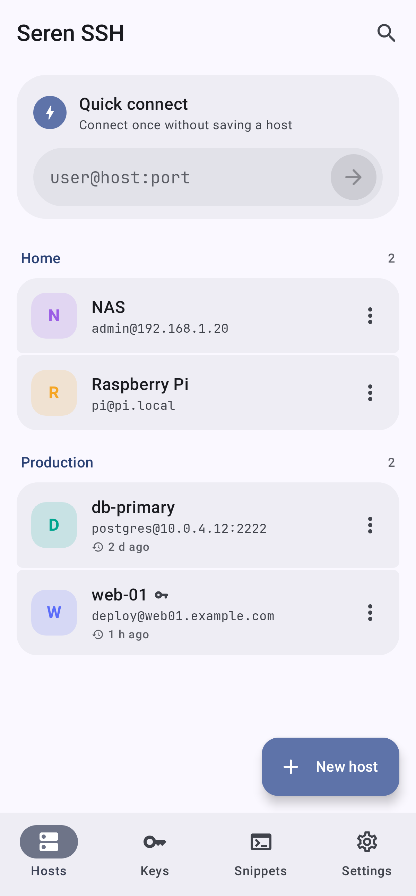
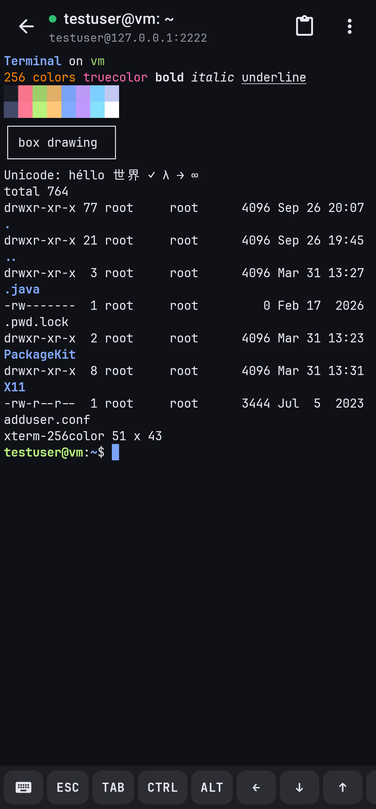

# Seren

**Seren** (Welsh for “star”, said *SEH-ren*) is a suite of free, open source Android apps with no
ads and no tracking.

This repository is the monorepo for the whole suite: each app in its own Gradle module, plus
**Seren Core**, the shared library that keeps them looking, feeling and behaving the same.

Every app makes the same promises:

| Promise | In practice |
| --- | --- |
| **Free, always** | No paid tier, no “pro” unlock, no nag screens |
| **No ads, no tracking** | No ad SDKs, no analytics, no crash reporters, no network calls you did not ask for |
| **Open source** | Full source here; builds with `./gradlew assembleRelease` |
| **Yours, on your device** | Data stays local; secrets use a hardware-backed key; nothing sensitive goes into cloud backup |

<p>
  
  
  
  
</p>
<p>
  
  
  
  
</p>

## Apps

| App | Module | Package | Status |
| --- | --- | --- | --- |
| **[Seren SSH](ssh)** | [`ssh`](ssh) | `wales.tucker.seren.ssh` | Ready for daily use |
| **[Seren Edit](edit)** | [`edit`](edit) | `wales.tucker.seren.edit` | Early days — edits well; no syntax highlighting or search yet |
| **[Seren Auth](auth)** | [`auth`](auth) | `wales.tucker.seren.auth` | New: codes, scanning, backup and import all work |
| **[Seren Files](files)** | [`files`](files) | `wales.tucker.seren.files` | New: browsing, copy and move, trash, zip and search all work |
| **[Seren Core](core)** | [`core`](core) | `wales.tucker.seren.core` | Shared theme, components, fonts and security helpers |

### Seren SSH

A modern, fast and easy to use SSH client for Android. Custom xterm-compatible terminal, public
key and password auth (including 2FA prompts), jump hosts, port forwarding, SFTP, and multiple
sessions kept alive in the background. Passwords and private keys are encrypted with the Android
Keystore.

→ Full features, architecture and tests: [`ssh/README.md`](ssh/README.md)

### Seren Edit

A modern, fast and easy to use text and code editor for Android. JetBrains Mono on the same color
schemes as Seren SSH, folders via the Storage Access Framework, recent files, and careful handling
of encodings and line endings. No storage or network permission — it only reaches files you choose.

→ Full features, architecture and tests: [`edit/README.md`](edit/README.md)

### Seren Auth

A modern, fast and easy to use authenticator for two-factor sign in codes. Time and counter based
codes, QR scanning with the camera or from an image, Google Authenticator transfer codes, encrypted
backups, and import from Aegis and andOTP. It has no network permission at all, and setup keys are
encrypted with the Android Keystore.

→ Full features, architecture and tests: [`auth/README.md`](auth/README.md)

### Seren Files

A modern, fast and easy to use file manager for Android. Internal storage, SD cards and bookmarks,
copy and move with clear choices when names clash, a 30 day trash with Undo, zip, search, recent files
and photo thumbnails. It has no network permission at all; its one permission is all files access,
asked for with a plain explanation.

→ Full features, architecture and tests: [`files/README.md`](files/README.md)

## Repository layout

```
seren/
├── core/          Seren Core (shared library)
├── ssh/           Seren SSH
├── edit/          Seren Edit
├── auth/          Seren Auth
├── files/         Seren Files
├── docs/BRAND.md  Brand and design guide for the suite
└── README.md      This file
```

Each app module has its own README, screenshots under `<module>/docs/screenshots`, and builds to
its own APK. Shared UI, fonts, `SecretBox`, backup encryption, the snackbar `Messenger`, app lock and
the links between the apps live in `core`, so a change there reaches every app.

## Building

Requirements: JDK 17 or newer and the Android SDK (platform 36).

```sh
./gradlew assembleDebug          # every app
./gradlew :ssh:assembleDebug     # Seren SSH only  → ssh/build/outputs/apk/debug/
./gradlew :edit:assembleDebug    # Seren Edit only → edit/build/outputs/apk/debug/
./gradlew :auth:assembleDebug    # Seren Auth only → auth/build/outputs/apk/debug/
./gradlew assembleRelease        # minified release APKs (debug-signed until you add signing config)
./gradlew testDebugUnitTest      # every module’s tests
```

CI builds and tests on every push and pull request; debug and release APKs are uploaded as
artifacts.

## Working together

Each app works on its own, and offers the others by name when they are installed:

- **Seren Files → Seren Edit:** "Open in Seren Edit" for any text file, saving back to it
- **Seren Files → Seren SSH:** "Upload with Seren SSH" to send files to a server over SFTP, and
  "Import into Seren SSH" for private keys
- **Seren SSH → Seren Files:** "Show in Seren Files" after an SFTP download
- **Seren SSH and Seren Auth** protect their backups with the same password encryption

They hand each other files through ordinary Android intents and content links, never secrets, and
the Seren-only actions need a permission only apps signed with the suite's key hold, so **sign every
app with the same release key**. Details: [docs/BRAND.md, section 19](docs/BRAND.md#19-working-together).

## Design

Colors, type, components, copy, icons and privacy patterns shared by every app are in
[docs/BRAND.md](docs/BRAND.md). The code that implements them is in [`core`](core).

## Licenses

Third-party licenses for each app are listed in that app’s README and in its About dialog.
JetBrains Mono (SIL OFL 1.1) ships in Seren Core; see `core/src/main/assets/licenses`.
