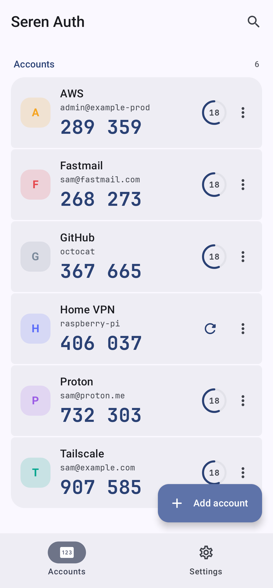
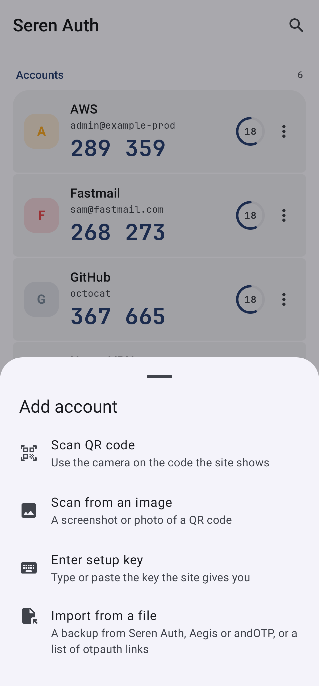
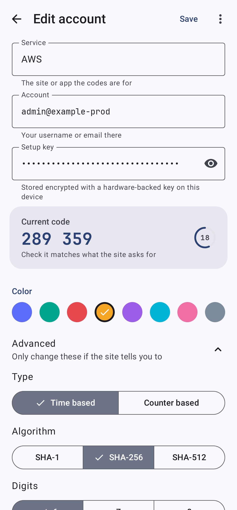
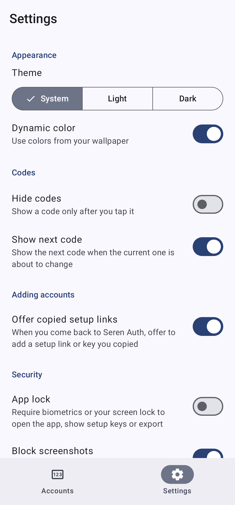
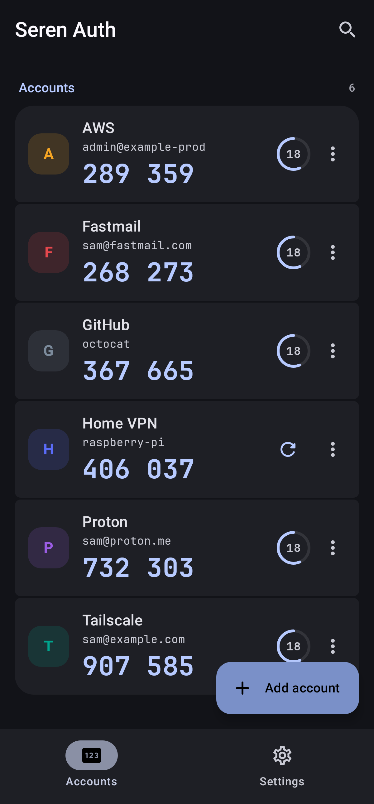
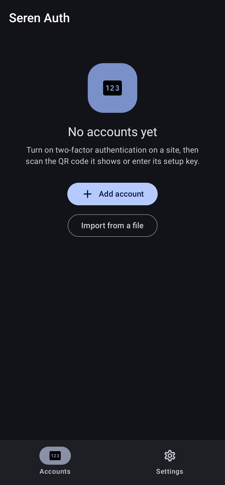
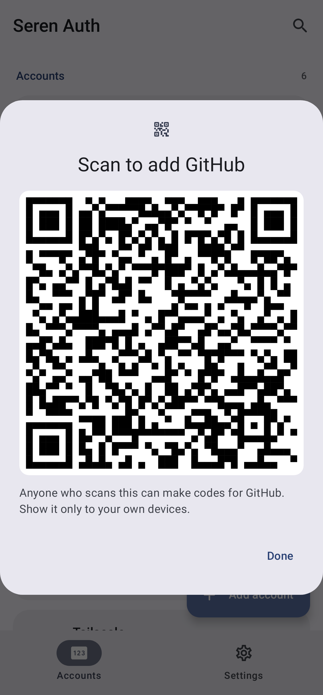
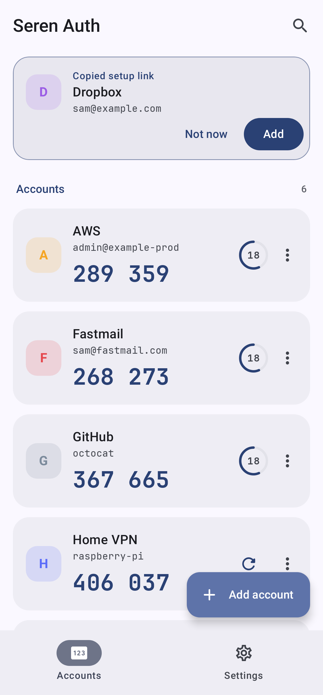

# Seren Auth

A modern, fast and easy to use authenticator for two-factor sign in codes on Android, built with
Kotlin and Jetpack Compose.

Seren is Welsh for star. Seren apps are free, open source, and have no ads and no tracking.

<p>
  
  
  
  
</p>
<p>
  
  
  
  
</p>

## Features

**Codes**
- Time based (TOTP) and counter based (HOTP) codes, SHA-1, SHA-256 or SHA-512, 6 to 8 digits, any period
- Large JetBrains Mono digits, grouped for reading out, with a countdown ring for each account
- Tap an account to copy its code; the clipboard hides it from previews and clears it after a minute
- The next code shows under the current one in its last seconds
- Optional hidden codes, shown only after a tap
- Search by service or account name

**Adding accounts**
- Scan the QR code a site shows, with the camera or from a screenshot or photo
- Enter or paste a setup key, or paste a whole otpauth link to fill in every field, with a live preview
  of the code to check against the site
- Open `otpauth://` links from a browser or another app
- Copied a setup link or key in another app? Come back to Seren Auth and a card offers to add it in
  one tap. Each copy is looked at once, and this can be turned off in Settings
- Scan Google Authenticator's "Transfer accounts" QR codes to bring every account over
- Duplicates are spotted by their setup key and never added twice

**Backup and moving devices**
- Encrypted backups: a documented JSON file, encrypted with AES-256-GCM using a key derived from
  your password with scrypt
- Export as a plain list of `otpauth://` links that most authenticator apps can import
- Import from Seren Auth, Aegis (plain or encrypted), andOTP, Google Authenticator or a list of links
- Show any account's QR code to add it on another device

**Privacy and security**
- No network permission at all: codes are made on the device from the time and the setup key
- Setup keys are encrypted with a hardware-backed Android Keystore key and kept out of cloud backups
- Screenshots and screen recording are blocked by default, which also hides codes in recent apps
- Optional app lock with biometrics or the device screen lock, also asked for before a setup key is
  shown or anything is exported
- The camera is only used to read QR codes; nothing is recorded

## Backup format

A Seren Auth backup is JSON:

```json
{
  "format": "seren-auth-backup",
  "version": 1,
  "encrypted": false,
  "accounts": [
    { "issuer": "GitHub", "name": "octocat", "secret": "JBSWY3DPEHPK3PXP", "type": "TOTP",
      "algorithm": "SHA1", "digits": 6, "period": 30, "counter": 0, "color": 7 }
  ]
}
```

An encrypted backup has `"encrypted": true` and replaces `accounts` with:

- `kdf`: `{ "algorithm": "scrypt", "n": 32768, "r": 8, "p": 1, "salt": "<Base64>" }`
- `cipher`: `{ "algorithm": "AES-256-GCM", "nonce": "<Base64, 12 bytes>" }`
- `data`: the Base64 AES-256-GCM encryption of the `accounts` array (UTF-8 JSON) with the 16 byte
  tag appended, using the 32 byte key scrypt derives from the UTF-8 password

## Building

From the repository root:

```sh
./gradlew :auth:assembleDebug      # auth/build/outputs/apk/debug/auth-debug.apk
./gradlew :auth:assembleRelease    # minified; signed with the debug key until you add a release signing config
```

## Tests

```sh
./gradlew :auth:testDebugUnitTest
```

This runs the HOTP and TOTP test vectors from RFC 4226 and RFC 6238, the Base32, otpauth link,
Google Authenticator, backup and import tests (including encrypted Aegis vaults), QR code reading,
and Robolectric UI tests that add, copy, edit, delete, import and export accounts and render the main
screens to `auth/build/screenshots`.

Robolectric can't settle a dialog that holds a text field, so the two password dialogs (choosing an
export password and unlocking an encrypted import) are tested through their view models rather than
by typing into them.

## Architecture

| Package | Contents |
| --- | --- |
| `otp` | `Otp` (HOTP and TOTP), `Base32`, `OtpAuthUri` (otpauth links), `GoogleMigration` (transfer QR codes) and `CopiedSetup` (spotting them in copied text) |
| `backup` | `BackupCrypto` (scrypt and AES-GCM), the Seren Auth, Aegis and andOTP formats and `Importer`, which recognises any of them |
| `qr` | `QrCodes`: reading QR codes from camera frames and images, and making them, with ZXing |
| `data` | Room database of accounts with encrypted setup keys, `AccountRepository` and DataStore settings |
| `ui` | The Accounts and Settings tabs, the account editor, the camera scanner and the import dialogs |

The theme, shared components, fonts, `SecretBox` and app lock come from [Seren Core](../core).

## Design

Colors, type, components, copy and icon rules shared by all the apps in the suite are in
[docs/BRAND.md](../docs/BRAND.md).

## Licenses

JetBrains Mono (SIL Open Font License 1.1, see `core/src/main/assets/licenses`), AndroidX, CameraX
and Jetpack Compose (Apache 2.0), ZXing (Apache 2.0), Bouncy Castle (MIT License).
