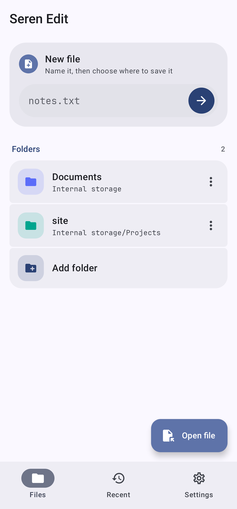
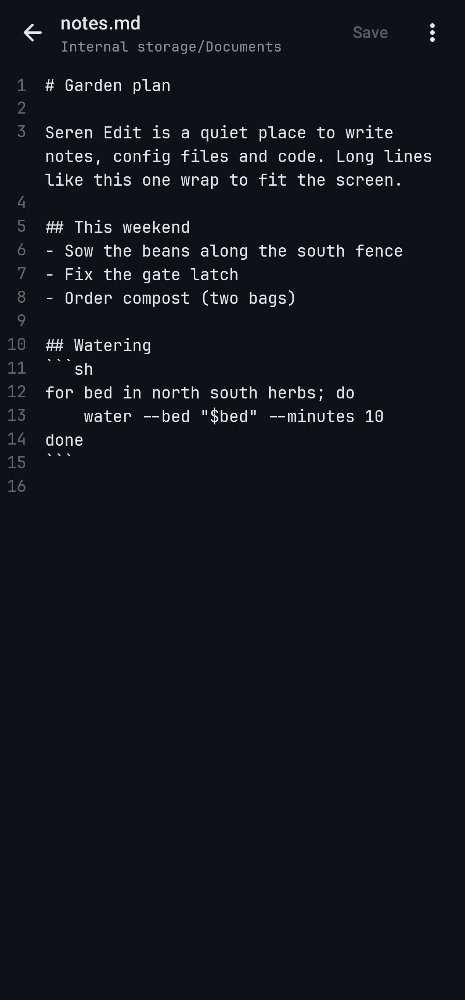
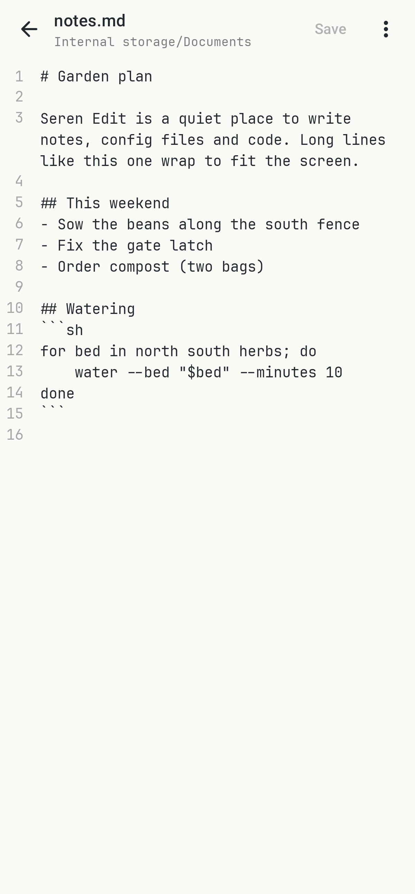
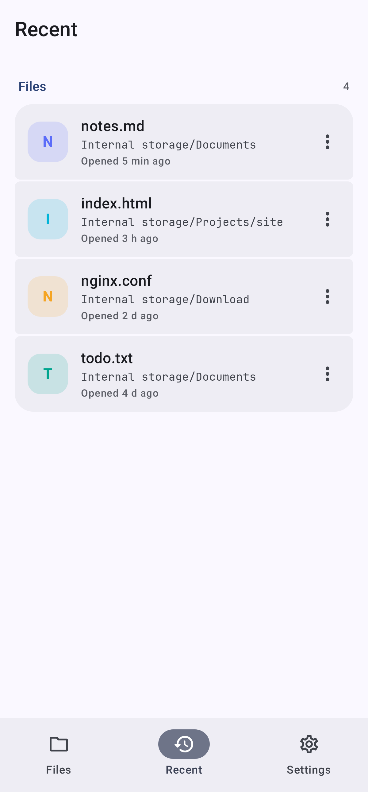
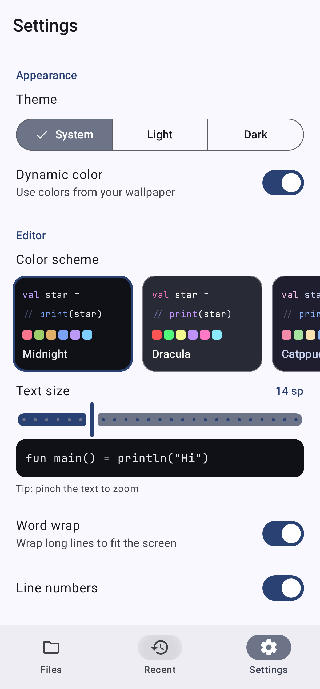

# Seren Edit

A modern, fast and easy to use text and code editor for Android, built with Kotlin and Jetpack
Compose.

Seren is Welsh for star. Seren apps are free, open source, and have no ads and no tracking.

<p>
  
  
  
  
</p>
<p>
  
</p>

Seren Edit is at an early stage: it edits files well, and the features below all work, but it has no
syntax highlighting yet.

## Features

**Editing**
- JetBrains Mono on a canvas in the same 11 color schemes as Seren SSH (Midnight by default)
- Line numbers, word wrap, pinch to zoom, and a text size setting with a live preview
- Extra keys row above the keyboard: Tab, arrows, Home/End, undo and redo, brackets and symbols
- New lines keep the indentation of the line above; Tab follows the file's own indentation
- Find and replace (Ctrl+F / Ctrl+H), with match-case; hardware shortcuts also cover save and undo/redo

**Files**
- Export and import of folder and recent-file metadata as JSON (SAF grants stay device-bound)
- Create a file anywhere, open any file, or add whole folders to browse from the Files tab
- "Open with Seren Edit" from other apps for text, JSON, XML, YAML, TOML and shell files, and
  "Open in Seren Edit" in Seren Files for any text file, dotfiles and config files included
- Recent files, each with its own color
- Keeps each file's encoding (UTF-8, UTF-8 or UTF-16 with a byte order mark, Latin-1) and line
  endings (LF, CRLF, CR), so saving never rewrites a file you didn't change
- Warns before opening files over 2 MB, refuses files over 16 MB, and refuses binary files with a clear reason rather than corrupting them
- Asks before discarding unsaved changes

**App**
- Material 3 design with dynamic color, light and dark themes
- No storage or network permissions: Seren Edit only reaches the files and folders you choose
- Optional app lock with biometrics or the device screen lock

## Building

From the repository root:

```sh
./gradlew :edit:assembleDebug      # edit/build/outputs/apk/debug/edit-debug.apk
./gradlew :edit:assembleRelease    # minified; signed with the suite key when SEREN_KEYSTORE_* are set (see root README Signing)
```

## Tests

```sh
./gradlew :edit:testDebugUnitTest
```

This runs the text codec and editing tests, and Robolectric UI tests that open, edit and save real
files and render the main screens to `edit/build/screenshots`.

## Architecture

| Package | Contents |
| --- | --- |
| `document` | `TextCodec` (encodings, byte order marks, line endings) and `DocumentStore` (Storage Access Framework reads, writes and folder listing) |
| `data` | Room database (recent files, folders) and DataStore settings |
| `ui/editor` | `EditorScreen`, `CodeEditor` (the canvas, line numbers, pinch to zoom), `TextEditing` (cursor movement and indentation) and the extra keys row |
| `ui` | The Files, Recent and Settings tabs and the folder browser |

The theme, shared components, fonts and app lock come from [Seren Core](../core).

## Design

Colors, type, components, copy and icon rules shared by all the apps in the suite are in
[docs/BRAND.md](../docs/BRAND.md).

## Licenses

JetBrains Mono (SIL Open Font License 1.1, see `core/src/main/assets/licenses`), AndroidX and
Jetpack Compose (Apache 2.0).
