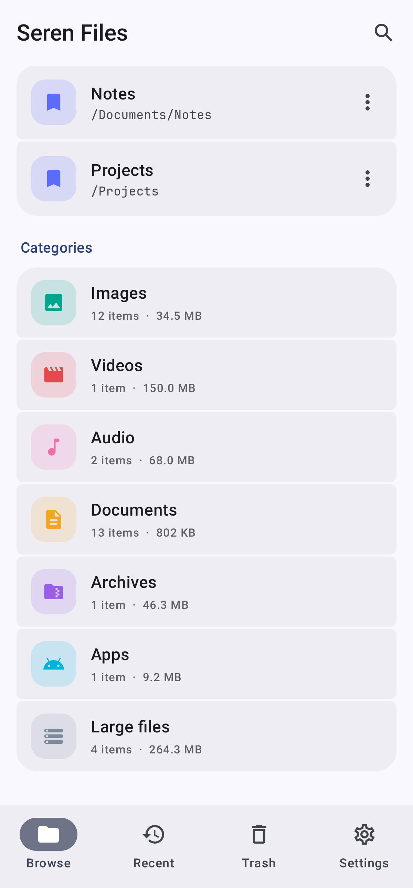
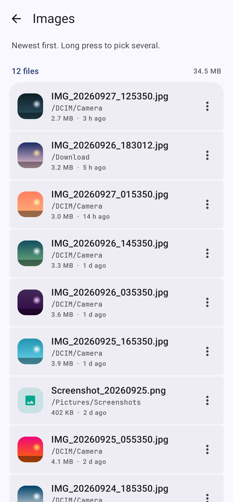
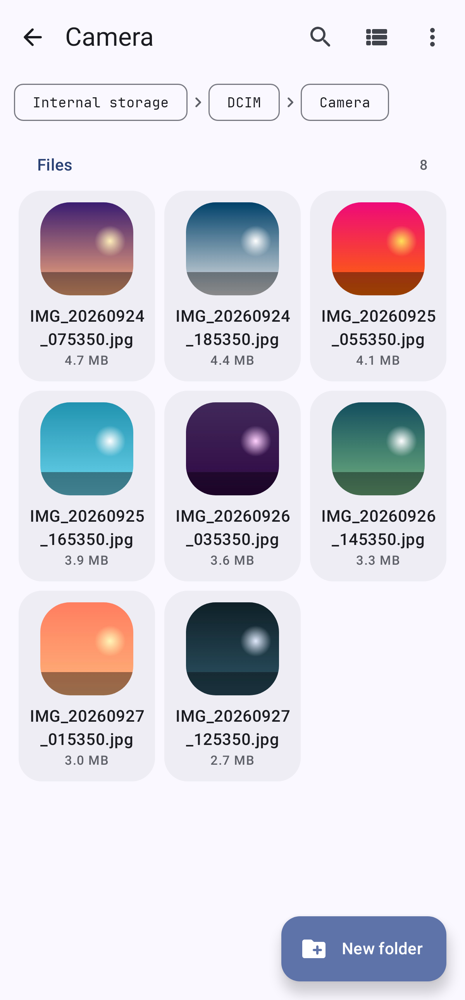

# Seren Files

A modern, fast and easy to use file manager for Android, built with Kotlin and Jetpack Compose.

Seren is Welsh for star. Seren apps are free, open source, and have no ads and no tracking.

<p>
  
  
  
  
</p>
<p>
  
  
  
  
</p>
<p>
  
  
  
</p>

## Features

**Browsing**
- Internal storage, SD cards and USB drives, each with how much space is free and a bar of how full it is
- Downloads, Documents, Camera, Pictures, Music and Movies one tap away, plus bookmarks for any folder
- Folders first, then files, sorted by name (the way people count: "photo 2" before "photo 10"),
  date changed, size or type, either way round
- Breadcrumbs to jump to any folder above, and Back retraces the folders you opened
- A list or a grid of large thumbnails, one tap to switch
- Thumbnails for photos and videos, an icon and color for every other kind of file
- Categories: every image, video, audio file, document, archive and app on the device in one list,
  and Large files (25 MB or more, biggest first) for freeing up space
- Add to home screen pins any folder as a shortcut that opens straight into it
- Hidden files on request, search by name through a folder and everything inside it
- Recent: files changed in the last 30 days, grouped into Today, Yesterday, This week and Earlier

**Working with files**
- Long press to pick several items, then copy, move, share, delete, rename, compress or see details
- Copy or Move, open another folder, Paste: when names are already taken, choose Replace (folders
  merge), Keep both ("photo (1).jpg") or Skip
- Moves on the same volume are instant renames; copies show progress, can be cancelled, keep dates,
  and never leave half-written files or lose the file they replace
- New folder, New file, and Rename, which starts with the name before the extension selected
- Compress to zip, and extract zip, 7z (including password protected ones), tar, tar.gz, tar.xz
  and tar.bz2 archives and single gz, xz and bz2 files, refusing archives that try to write outside
  their folder and leaving out links inside them
- A copy that won't fit is refused before it starts, saying how much it needs and how much is free
- Long jobs keep going after you leave the app, with a notification showing progress and Cancel,
  and one saying how it ended if you're elsewhere by then
- Open or share through a content link, never a raw path; Open with to choose the app
- Details: type, size (counted for whole folders), date, where it is, and its SHA-256 on request

**With other apps**
- Save to Seren Files in the share sheet: open a folder, then Save here. Shared text is saved as a
  .txt file, nothing already there is replaced, and links to another app's private files are refused
- Choose a file for another app's attach or upload button, showing only the types it asked for, and
  several when it allows; it gets a read only content link to each, never a path

**With the other Seren apps**
- "Open in Seren Edit" for text files, including dotfiles and files with no extension, which
  Seren Edit can save back to
- "Upload with Seren SSH" for one file or several picked ones, and "Import into Seren SSH" for
  private keys (`id_ed25519`, `.pem`, `.ppk`)
- Seren SSH's "Show in Seren Files" opens the folder a download was saved in, scrolled to it
- Each appears only when that app is installed

**Trash**
- Deleting moves things to a trash folder on the same volume, instantly, with Undo
- Restore puts items back where they were, recreating the folder if needed and never overwriting
- Long press to pick several, then restore or delete them together
- Items are deleted for good after 30 days; Empty trash and Delete permanently for sooner
- The trash can be turned off, so deleting is permanent (and says so)

**Privacy and security**
- No network permission at all: nothing Seren Files sees ever leaves the device
- One clearly explained permission, all files access, which it asks for only when you tap Allow access;
  on Android 13 and newer it also asks once to show progress notifications, when the first long job starts
- Optional app lock with biometrics or the device screen lock, which also hides the app in recent apps

## Storage access

A file manager has to see every file, so Seren Files uses **all files access**
(`MANAGE_EXTERNAL_STORAGE`) on Android 11 and newer, which you turn on in the system settings, and the
storage permissions on Android 8 to 10. Until then it shows what it needs and why, with a button to
allow it. Android keeps other apps' `Android/data` and `Android/obb` folders private, so Seren Files
doesn't show them.

## Trash

Deleted items move into a hidden `.SerenTrash` folder at the root of the volume they were on (with a
`.nomedia` file so gallery and music apps skip it), and the database remembers where each came from.
Because the trash stays on the same volume, moving to it and restoring from it are instant however
large the item. Files are never uploaded or copied anywhere else. If Seren Files is uninstalled, the
folder and what's in it stay, so nothing is lost.

## Building

From the repository root:

```sh
./gradlew :files:assembleDebug      # files/build/outputs/apk/debug/files-debug.apk
./gradlew :files:assembleRelease    # minified; signed with the debug key until you add a release signing config
```

## Tests

```sh
./gradlew :files:testDebugUnitTest
```

This runs JVM tests of sorting, file types, copying and moving (conflicts, merging, keeping both,
moving into itself, cancelling, progress, links, free space), saving streams, zip compression and
extraction (including zip slip), 7z extraction (against archives made by py7zr: long and non-ASCII
names, links, passwords, slips and a compression method it can't read), tar, tar.gz, tar.xz,
tar.bz2, gz, xz and bz2 extraction (against archives made by GNU tar, xz and bzip2, with long names,
pax headers and links), categories, and search; Robolectric tests of the trash, the
progress notification and Cancel, and the operations behind each action and what they report; and UI
tests that browse, copy and paste, pick and move several files, delete with Undo, restore or delete
several from the trash, search, extract and bookmark, switch to the grid, browse categories, save
files and text shared from other apps, choose files for another app, pin folders to the home screen,
offer the other Seren apps and show files they ask about, then render the main screens to
`files/build/screenshots`.

Robolectric can't settle a dialog that holds a text field, so New folder, New file, Rename, Compress
and a 7z file's password are tested through `Operations` rather than by typing into their dialogs.

## Architecture

| Package | Contents |
| --- | --- |
| `fs` | Plain `java.io` file work: `Listing` and `NaturalOrder`, `FileTypes`, `FileOps` (names, copy, move, save, delete, measure, SHA-256), `Archives`, `TarReader` and `SevenZ` (zip, 7z, tar and its compressed kinds, gz, xz, bz2), `Categories`, `Search`, `Storage` (volumes, access, and recent and all files from the media store) and `Reveal` (which file another app's link points at) |
| `data` | Room database of bookmarks and trash items, `TrashBin`, and DataStore settings |
| `ops` | `Operations`: every change to files, run in an app-wide scope with progress, cancelling, the copy and move clipboard, files shared in to save (`Incoming`) and snackbar messages; `OperationService` keeps long jobs running with a notification |
| `pick` | `PickActivity`: choosing files for another app, with `PickRequest` reading what it asked for |
| `ui` | The Browse, Recent, Trash and Settings tabs, categories, the folder screen with list and grid, picking, search, paste and save, dialogs, thumbnails, home screen shortcuts and opening files in other apps |

The theme, shared components (including `GroupedTile` picking and the `Messenger` snackbar), fonts
and app lock come from [Seren Core](../core).

## Design

Colors, type, components, copy and icon rules shared by all the apps in the suite are in
[docs/BRAND.md](../docs/BRAND.md).

## Licenses

JetBrains Mono (SIL Open Font License 1.1, see `core/src/main/assets/licenses`), AndroidX, Jetpack
Compose and Apache Commons Compress (Apache 2.0), and XZ for Java (public domain).
