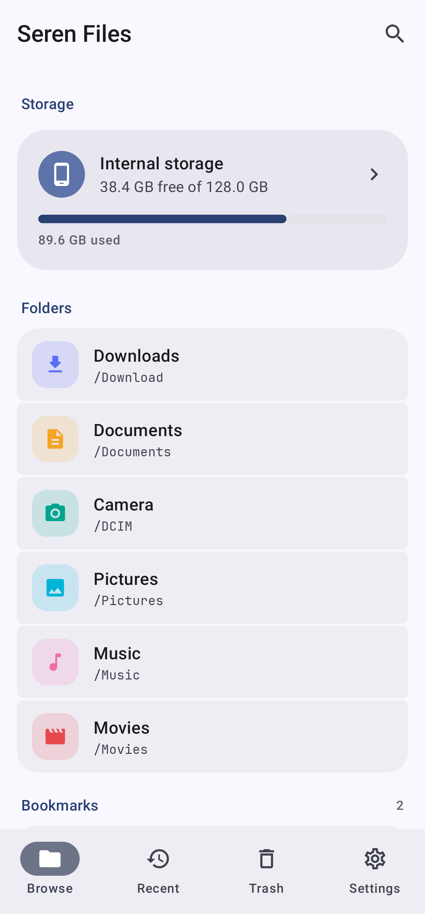
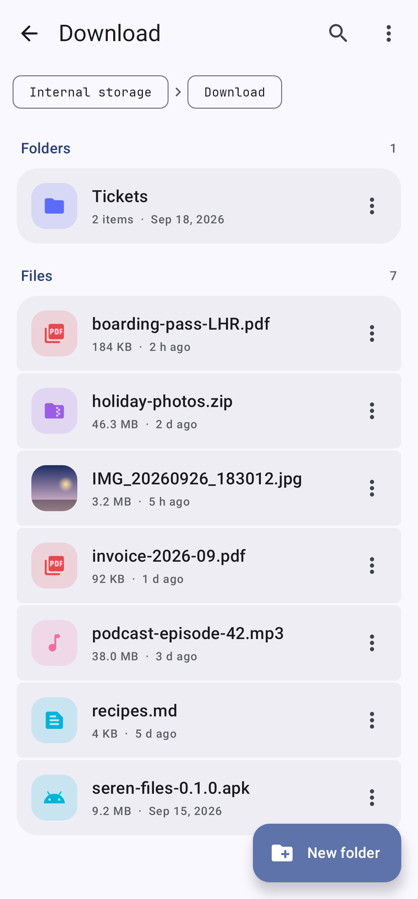
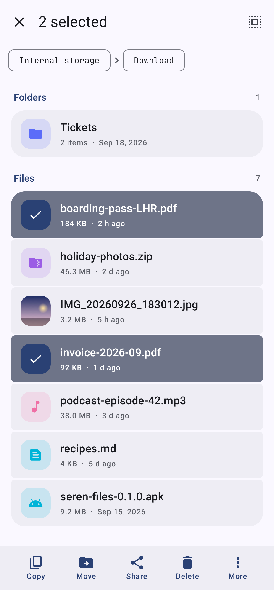
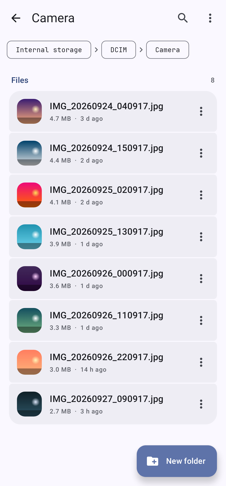
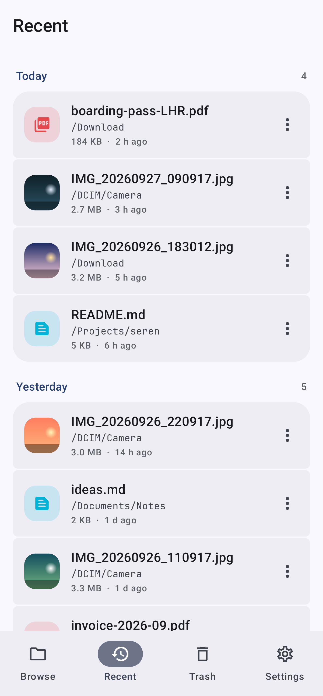
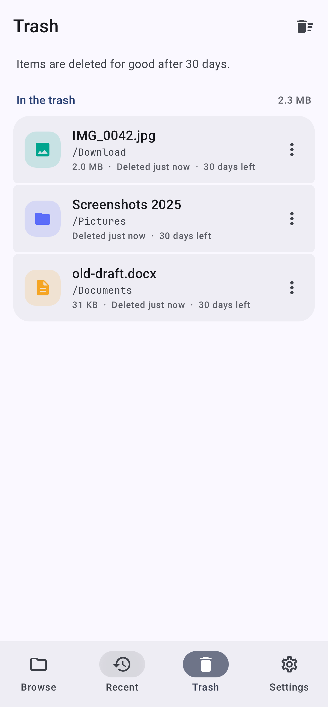
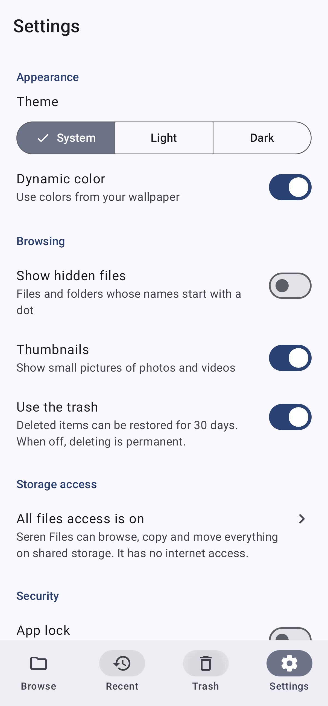
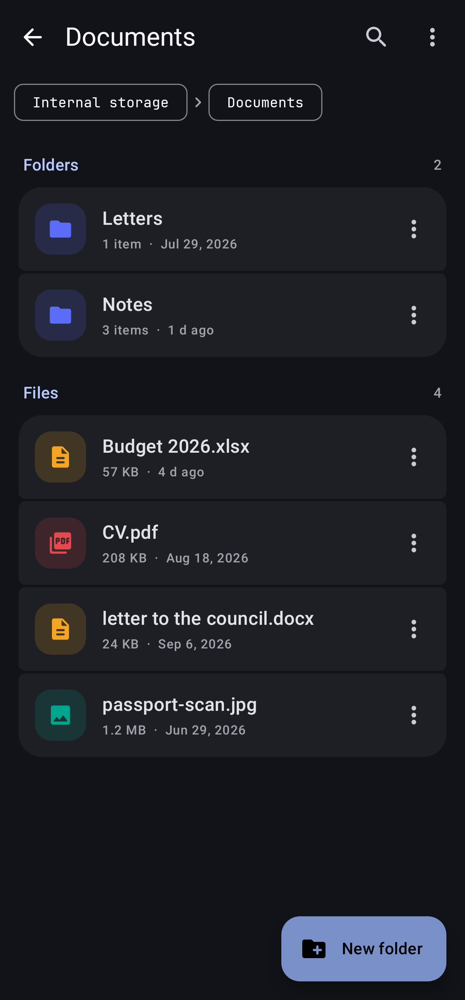

# Seren Files

A modern, fast and easy to use file manager for Android, built with Kotlin and Jetpack Compose.

Seren is Welsh for star. Seren apps are free, open source, and have no ads and no tracking.

<p>
  
  
  
  
</p>
<p>
  
  
  
  
</p>

## Features

**Browsing**
- Internal storage, SD cards and USB drives, each with how much space is free and a bar of how full it is
- Downloads, Documents, Camera, Pictures, Music and Movies one tap away, plus bookmarks for any folder
- Folders first, then files, sorted by name (the way people count: "photo 2" before "photo 10"),
  date changed, size or type, either way round
- Breadcrumbs to jump to any folder above, and Back retraces the folders you opened
- Thumbnails for photos and videos, an icon and color for every other kind of file
- Hidden files on request, search by name through a folder and everything inside it
- Recent: files changed in the last 30 days, grouped into Today, Yesterday, This week and Earlier

**Working with files**
- Long press to pick several items, then copy, move, share, delete, rename, compress or see details
- Copy or Move, open another folder, Paste: when names are already taken, choose Replace (folders
  merge), Keep both ("photo (1).jpg") or Skip
- Moves on the same volume are instant renames; copies show progress, can be cancelled, keep dates,
  and never leave half-written files or lose the file they replace
- New folder, New file, and Rename, which starts with the name before the extension selected
- Compress to zip and extract zips, refusing archives that try to write outside their folder
- Open or share through a content link, never a raw path; Open with to choose the app
- Details: type, size (counted for whole folders), date, where it is, and its SHA-256 on request

**Trash**
- Deleting moves things to a trash folder on the same volume, instantly, with Undo
- Restore puts items back where they were, recreating the folder if needed and never overwriting
- Items are deleted for good after 30 days; Empty trash and Delete permanently for sooner
- The trash can be turned off, so deleting is permanent (and says so)

**Privacy and security**
- No network permission at all: nothing Seren Files sees ever leaves the device
- One clearly explained permission, all files access, which it asks for only when you tap Allow access
- Optional app lock with biometrics or the device screen lock, which also hides the app in recent apps

## Storage access

A file manager has to see every file, so Seren Files uses **all files access**
(`MANAGE_EXTERNAL_STORAGE`) on Android 11 and newer, which you turn on in the system settings, and the
storage permissions on Android 8 to 10. Until then it shows what it needs and why, with a button to
allow it. Android keeps other apps' `Android/data` and `Android/obb` folders private, so Seren Files
doesn't show them.

## Trash

Deleted items move into a hidden `.SerenTrash` folder at the root of the volume they were on (with a
`.nomedia` file so gallery and music apps skip it), and the database remembers where each came from.
Because the trash stays on the same volume, moving to it and restoring from it are instant however
large the item. Files are never uploaded or copied anywhere else. If Seren Files is uninstalled, the
folder and what's in it stay, so nothing is lost.

## Building

From the repository root:

```sh
./gradlew :files:assembleDebug      # files/build/outputs/apk/debug/files-debug.apk
./gradlew :files:assembleRelease    # minified; signed with the debug key until you add a release signing config
```

## Tests

```sh
./gradlew :files:testDebugUnitTest
```

This runs JVM tests of sorting, file types, copying and moving (conflicts, merging, keeping both,
moving into itself, cancelling, progress, links), zip compression and extraction (including zip
slip), and search; Robolectric tests of the trash and of the operations behind each action and what
they report; and UI tests that browse, copy and paste, pick and move several files, delete with Undo,
restore from the trash, search, extract and bookmark, then render the main screens to
`files/build/screenshots`.

Robolectric can't settle a dialog that holds a focused text field, so New folder, New file, Rename
and Compress are tested through `Operations` rather than by typing into their dialogs.

## Architecture

| Package | Contents |
| --- | --- |
| `fs` | Plain `java.io` file work: `Listing` and `NaturalOrder`, `FileTypes`, `FileOps` (names, copy, move, delete, measure, SHA-256), `Archives` (zip), `Search`, and `Storage` (volumes, access and recent files from the media store) |
| `data` | Room database of bookmarks and trash items, `TrashBin`, and DataStore settings |
| `ops` | `Operations`: every change to files, run in an app-wide scope with progress, cancelling, the copy and move clipboard and snackbar messages |
| `ui` | The Browse, Recent, Trash and Settings tabs, the folder screen with picking, search and paste, dialogs, thumbnails and opening files in other apps |

The theme, shared components (including `GroupedTile` picking and the `Messenger` snackbar), fonts
and app lock come from [Seren Core](../core).

## Design

Colors, type, components, copy and icon rules shared by all the apps in the suite are in
[docs/BRAND.md](../docs/BRAND.md).

## Licenses

JetBrains Mono (SIL Open Font License 1.1, see `core/src/main/assets/licenses`), AndroidX and Jetpack
Compose (Apache 2.0).
